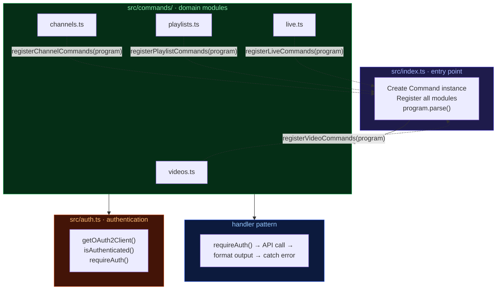

# CLI Tool Architecture Pattern

A battle-tested pattern for building TypeScript CLI tools using Commander.js with modular command registration, OAuth2 authentication, and consistent handler conventions.

---

## Core Idea

Commands are organized as **domain modules** that each export a registration function. A single entry point creates the CLI program and delegates to each module. Every handler follows the same structure: auth guard, API call, formatted output, error handling.

---

## Architecture Overview



---

## Directory Structure

```
project/
├── src/
│   ├── index.ts              # Entry point — creates program, registers modules
│   ├── auth.ts               # OAuth2 module (also standalone: npm run auth)
│   └── commands/
│       ├── videos.ts         # videos, thumbnails, captions, video-categories
│       ├── channels.ts       # channels, channel-sections
│       ├── playlists.ts      # playlists, playlist-items
│       ├── comments.ts       # comment-threads, comments
│       ├── subscriptions.ts  # subscriptions
│       ├── live.ts           # live broadcasts, streams, chat, moderators, bans
│       └── activities.ts     # activities, i18n, members, super-chat
├── tests/
│   ├── setup.ts              # Global test setup (mocks process.exit)
│   ├── helpers.ts            # Test utilities (captureOutput, makeProgram)
│   ├── cli.test.ts           # Smoke tests (spawn real CLI)
│   └── *.test.ts             # Per-module unit tests
├── package.json
├── tsconfig.json
├── vitest.config.ts
├── .env.example
├── .gitignore
└── AGENT_SKILL.md            # Optional: AI agent usage reference
```

---

## Entry Point (`src/index.ts`)

```typescript
#!/usr/bin/env node
import 'dotenv/config';
import { Command } from 'commander';
import { registerVideoCommands } from './commands/videos.js';
import { registerChannelCommands } from './commands/channels.js';
// ... more imports

const program = new Command();
program.name('youtube').description('CLI for the YouTube Data API v3').version('0.1.0');

registerVideoCommands(program);
registerChannelCommands(program);
// ... more registrations

program.parse();
```

The entry point is thin. It creates a single `Command` instance and passes it to each module's registration function. Nothing else.

---

## Command Module Pattern

Every command file follows the same structure:

```typescript
import { Command } from 'commander';
import { google } from 'googleapis';
import chalk from 'chalk';
import { getOAuth2Client, requireAuth } from '../auth.js';

// 1. API client factory
function yt() {
  return google.youtube({ version: 'v3', auth: getOAuth2Client() });
}

// 2. Output formatters
function printVideo(video: any) {
  console.log(chalk.bold(video.snippet.title));
  console.log(chalk.cyan(video.id));
  console.log(chalk.dim(video.snippet.publishedAt));
}

// 3. Registration function
export function registerVideoCommands(program: Command) {
  const cmd = program.command('videos').description('Manage YouTube videos');

  cmd.command('search <query>')
    .description('Search for videos')
    .option('--max-results <n>', 'Max results', '10')
    .option('--json', 'Output as JSON')
    .action(async (query, opts) => {
      requireAuth();
      try {
        const res = await yt().search.list({
          part: ['snippet'],
          q: query,
          maxResults: parseInt(opts.maxResults),
        });
        if (opts.json) {
          console.log(JSON.stringify(res.data, null, 2));
          return;
        }
        res.data.items?.forEach(printVideo);
      } catch (err: any) {
        console.error(chalk.red('Error:'), err.message);
        process.exit(1);
      }
    });

  cmd.command('get <id>')
    .description('Get video by ID')
    .option('--json', 'Output as JSON')
    .action(async (id, opts) => {
      requireAuth();
      try {
        const res = await yt().videos.list({
          part: ['snippet', 'contentDetails', 'statistics'],
          id: [id],
        });
        if (opts.json) {
          console.log(JSON.stringify(res.data, null, 2));
          return;
        }
        res.data.items?.forEach(printVideo);
      } catch (err: any) {
        console.error(chalk.red('Error:'), err.message);
        process.exit(1);
      }
    });

  // Destructive commands include --yes flag
  cmd.command('delete <id>')
    .description('Delete a video')
    .option('--yes', 'Skip confirmation')
    .action(async (id, opts) => {
      requireAuth();
      if (!opts.yes) {
        const confirm = await prompt('Are you sure? (y/N) ');
        if (confirm.toLowerCase() !== 'y') return;
      }
      try {
        await yt().videos.delete({ id });
        console.log(chalk.green('Video deleted'));
      } catch (err: any) {
        console.error(chalk.red('Error:'), err.message);
        process.exit(1);
      }
    });

  // Sub-resources registered as sibling top-level commands
  const thumbCmd = program.command('thumbnails').description('Manage thumbnails');
  thumbCmd.command('set <video-id> <file>')
    .description('Set video thumbnail')
    .action(async (videoId, file) => { /* ... */ });
}
```

---

## Command Registration Conventions

| Convention | Example |
|------------|---------|
| Top-level commands | `youtube videos search "query"` |
| Sub-resources as siblings | `youtube thumbnails set <id> <file>` (not `youtube videos thumbnails set`) |
| Comma-separated IDs | `--ids "id1,id2,id3"` parsed via `.split(',')` |
| Pagination | `--page-token <token>` with `nextPageToken` in output |
| Machine output | `--json` flag on all read commands |
| Skip confirmations | `--yes` flag on destructive commands |
| Auth guard | `requireAuth()` at the top of every action |

---

## Authentication Module (`src/auth.ts`)

The auth module serves dual purposes: a library imported by commands and a standalone script run via `npm run auth`.

```typescript
import { google } from 'googleapis';
import { readFileSync, writeFileSync, existsSync } from 'fs';
import open from 'open';
import http from 'http';

const CREDENTIALS_PATH = 'youtube-credentials.json';
const TOKEN_PATH = 'youtube-token.json';
const SCOPES = [
  'https://www.googleapis.com/auth/youtube',
  'https://www.googleapis.com/auth/youtube.force-ssl',
  'https://www.googleapis.com/auth/youtube.upload',
  'https://www.googleapis.com/auth/youtubepartner',
];

export function getOAuth2Client() {
  const credentials = JSON.parse(readFileSync(CREDENTIALS_PATH, 'utf-8'));
  const { client_id, client_secret, redirect_uris } = credentials.installed;
  const oauth2Client = new google.auth.OAuth2(client_id, client_secret, redirect_uris[0]);

  if (existsSync(TOKEN_PATH)) {
    const token = JSON.parse(readFileSync(TOKEN_PATH, 'utf-8'));
    oauth2Client.setCredentials(token);
  } else {
    // Interactive auth flow
    const authUrl = oauth2Client.generateAuthUrl({
      access_type: 'offline',
      scope: SCOPES,
    });
    console.log('Authorize this app by visiting:', authUrl);
    open(authUrl);
    // Start local server to capture callback, exchange for tokens, save to TOKEN_PATH
  }

  return oauth2Client;
}

export function isAuthenticated(): boolean {
  return existsSync(TOKEN_PATH);
}

export function requireAuth(): void {
  if (!isAuthenticated()) {
    console.error('Not authenticated. Run: npm run auth');
    process.exit(1);
  }
}
```

---

## Handler Pattern

Every action handler follows this exact structure:

```
1. requireAuth()           — Guard clause, exits if not authenticated
2. try { API call }        — Google API call with proper params
3. if (opts.json)          — JSON output strategy
4. else                    — Human-formatted output with chalk
5. catch (err)             — Error logging with chalk.red, process.exit(1)
```

No handler deviates from this pattern. This consistency makes every command predictable and easy to audit.

---

## Configuration

### `package.json`

```json
{
  "name": "youtube-cli",
  "type": "module",
  "bin": { "youtube": "./dist/index.js" },
  "scripts": {
    "dev": "tsx src/index.ts",
    "build": "tsc",
    "start": "node dist/index.js",
    "auth": "tsx src/auth.ts",
    "test": "vitest"
  },
  "dependencies": {
    "commander": "^12.0.0",
    "googleapis": "^144.0.0",
    "chalk": "^5.3.0",
    "dotenv": "^16.0.0",
    "open": "^10.1.0"
  },
  "devDependencies": {
    "typescript": "^5.0.0",
    "tsx": "^4.0.0",
    "vitest": "^2.0.0",
    "@vitest/coverage-v8": "^2.0.0",
    "@types/node": "^20.0.0",
    "execa": "^9.0.0"
  }
}
```

### `tsconfig.json`

```json
{
  "compilerOptions": {
    "target": "ES2022",
    "module": "ES2022",
    "moduleResolution": "node",
    "strict": true,
    "outDir": "./dist",
    "resolveJsonModule": true,
    "esModuleInterop": true
  },
  "include": ["src/**/*"]
}
```

---

## Testing Pattern

### Two tiers

**Smoke tests** — Spawn the real CLI via `execa`, test `--help` and `--version`. No mocking.

```typescript
import { execa } from 'execa';
import { describe, it, expect } from 'vitest';

describe('CLI smoke tests', () => {
  it('shows help', async () => {
    const { stdout } = await execa('npx', ['tsx', 'src/index.ts', '--help']);
    expect(stdout).toContain('youtube');
  });

  it('shows version', async () => {
    const { stdout } = await execa('npx', ['tsx', 'src/index.ts', '--version']);
    expect(stdout).toContain('0.1.0');
  });
});
```

**Unit tests** — Mock `googleapis` and `auth`, use `makeProgram()` for isolated Commander instances.

```typescript
// tests/helpers.ts
import { Command } from 'commander';

export function makeProgram(register: (program: Command) => void) {
  const program = new Command();
  program.exitOverride();
  program.configureOutput({ writeOut: () => {}, writeErr: () => {} });
  register(program);
  return program;
}

export function captureOutput() {
  const logs: string[] = [];
  const errors: string[] = [];
  vi.spyOn(console, 'log').mockImplementation((...args) => logs.push(args.join(' ')));
  vi.spyOn(console, 'error').mockImplementation((...args) => errors.push(args.join(' ')));
  return { logs, errors };
}
```

### Global test setup

```typescript
// tests/setup.ts
import { vi } from 'vitest';

vi.spyOn(process, 'exit').mockImplementation(((code: number) => {
  throw new Error(`process.exit(${code})`);
}) as any);
```

---

## Design Patterns

| Pattern | Where |
|---------|-------|
| **Command Pattern** | Commander.js nested `command().action()` chains |
| **Module Registration** | Each file exports `register*Commands(program)` that mutates shared instance |
| **Factory Function** | `yt()` creates fresh API client per call |
| **Guard Clause** | `requireAuth()` at top of every handler |
| **Strategy (output)** | `--json` switches between human and machine output |
| **Builder Pattern** | Commander fluent API: `.command().description().option().action()` |

---

## Key Principles

### 1. Flat command topology

Sub-resources (`thumbnails`, `captions`, `playlist-items`) are registered as **sibling top-level commands**, not nested under parents. This keeps the CLI surface simple and avoids deep nesting that's tedious to type.

### 2. Thin entry point

`index.ts` does nothing but create the program and register modules. No logic, no API calls, no formatting.

### 3. Consistent handler structure

Every handler: auth → try → API → output → catch. No exceptions. This makes code review fast and bugs obvious.

### 4. No shared service layer

Each module creates its own API client via `yt()`. No centralized service or repository. The factory is cheap and the API client is lightweight.

### 5. No abstraction over the API

Command files are thin wrappers around the Google API. They handle parsing, auth, and formatting — nothing more. Don't over-engineer.

### 6. Dual-purpose auth module

`auth.ts` works as both a library (imported by commands) and a standalone script (`npm run auth`). One file, two uses.

### 7. Promote, don't pre-share

Start everything in the command module that needs it. Extract to a shared utility only when two modules actually need the same logic.

---

## What This Is Not

- **Not a dependency injection framework**. Dependencies are imported directly. The `yt()` factory is sufficient.
- **Not a hierarchical CLI**. Sub-resources are siblings, not nested children. `youtube thumbnails set` not `youtube videos thumbnails set`.
- **Not a service layer architecture**. Commands call the API directly. No repository, no service, no adapter.
- **Not over-engineered**. The pattern is deliberately simple. Commander + modules + consistent handlers.
