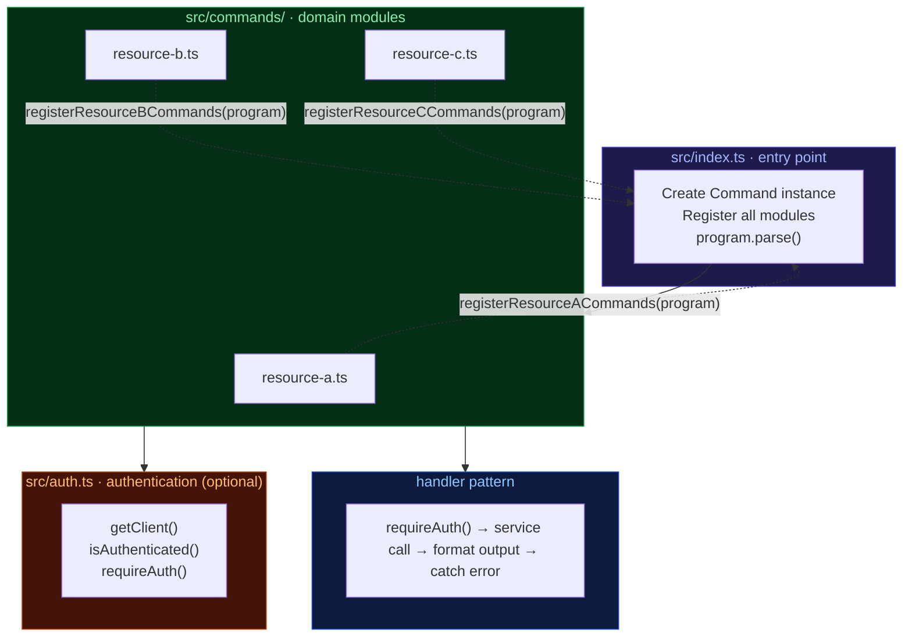

# CLI Tool Architecture Pattern

A battle-tested pattern for building TypeScript CLI tools using Commander.js with modular command registration, optional authentication, and consistent handler conventions.

---

## Core Idea

Commands are organized as **domain modules** that each export a registration function. A single entry point creates the CLI program and delegates to each module. Every handler follows the same structure: guard checks, service call, formatted output, error handling.

---

## Architecture Overview



---

## Directory Structure

```
project/
├── src/
│   ├── index.ts              # Entry point — creates program, registers modules
│   ├── auth.ts               # Auth module (optional, also standalone script)
│   └── commands/
│       ├── resource-a.ts     # resource-a, resource-a-sub commands
│       ├── resource-b.ts     # resource-b, resource-b-sub commands
│       └── resource-c.ts     # resource-c commands
├── tests/
│   ├── setup.ts              # Global test setup (mocks process.exit)
│   ├── helpers.ts            # Test utilities (captureOutput, makeProgram)
│   ├── cli.test.ts           # Smoke tests (spawn real CLI)
│   └── *.test.ts             # Per-module unit tests
├── package.json
├── tsconfig.json
├── vitest.config.ts
├── .env.example
└── .gitignore
```

---

## Entry Point (`src/index.ts`)

```typescript
#!/usr/bin/env node
import 'dotenv/config';
import { Command } from 'commander';
import { registerResourceACommands } from './commands/resource-a.js';
import { registerResourceBCommands } from './commands/resource-b.js';
// ... more imports

const program = new Command();
program.name('mycli').description('CLI for managing resources').version('0.1.0');

registerResourceACommands(program);
registerResourceBCommands(program);
// ... more registrations

program.parse();
```

The entry point is thin. It creates a single `Command` instance and passes it to each module's registration function. Nothing else.

---

## Command Module Pattern

Every command file follows the same structure:

```typescript
import { Command } from 'commander';
import chalk from 'chalk';
import { requireAuth } from '../auth.js';
import { createClient } from '../client.js';

// 1. Client factory
function client() {
  return createClient();
}

// 2. Output formatters
function printItem(item: any) {
  console.log(chalk.bold(item.name));
  console.log(chalk.cyan(item.id));
  console.log(chalk.dim(item.createdAt));
}

// 3. Registration function
export function registerResourceACommands(program: Command) {
  const cmd = program.command('items').description('Manage items');

  cmd.command('search <query>')
    .description('Search for items')
    .option('--max-results <n>', 'Max results', '10')
    .option('--json', 'Output as JSON')
    .action(async (query, opts) => {
      requireAuth();
      try {
        const res = await client().items.search({
          q: query,
          limit: parseInt(opts.maxResults),
        });
        if (opts.json) {
          console.log(JSON.stringify(res, null, 2));
          return;
        }
        res.items?.forEach(printItem);
      } catch (err: any) {
        console.error(chalk.red('Error:'), err.message);
        process.exit(1);
      }
    });

  cmd.command('get <id>')
    .description('Get item by ID')
    .option('--json', 'Output as JSON')
    .action(async (id, opts) => {
      requireAuth();
      try {
        const res = await client().items.get({ id });
        if (opts.json) {
          console.log(JSON.stringify(res, null, 2));
          return;
        }
        printItem(res);
      } catch (err: any) {
        console.error(chalk.red('Error:'), err.message);
        process.exit(1);
      }
    });

  // Destructive commands include --yes flag
  cmd.command('delete <id>')
    .description('Delete an item')
    .option('--yes', 'Skip confirmation')
    .action(async (id, opts) => {
      requireAuth();
      if (!opts.yes) {
        const confirm = await prompt('Are you sure? (y/N) ');
        if (confirm.toLowerCase() !== 'y') return;
      }
      try {
        await client().items.delete({ id });
        console.log(chalk.green('Item deleted'));
      } catch (err: any) {
        console.error(chalk.red('Error:'), err.message);
        process.exit(1);
      }
    });

  // Sub-resources registered as sibling top-level commands
  const metaCmd = program.command('metadata').description('Manage item metadata');
  metaCmd.command('set <item-id> <key> <value>')
    .description('Set item metadata')
    .action(async (itemId, key, value) => { /* ... */ });
}
```

---

## Command Registration Conventions

| Convention | Example |
|------------|---------|
| Top-level commands | `mycli items search "query"` |
| Sub-resources as siblings | `mycli metadata set <id> <key> <val>` (not `mycli items metadata set`) |
| Comma-separated IDs | `--ids "id1,id2,id3"` parsed via `.split(',')` |
| Pagination | `--page-token <token>` with `nextPageToken` in output |
| Machine output | `--json` flag on all read commands |
| Skip confirmations | `--yes` flag on destructive commands |
| Auth guard | `requireAuth()` at the top of every action (if auth is needed) |

---

## Authentication Module (`src/auth.ts`)

The auth module serves dual purposes: a library imported by commands and a standalone script run via `npm run auth`. Adapt the auth mechanism to your use case — OAuth2, API keys, tokens, etc.

For OAuth flows that spin up a local callback server, accept a `--port <n>` argument to override the port at runtime, falling back to the port in the credentials file or a hardcoded default:

```typescript
const portArg = process.argv[process.argv.indexOf('--port') + 1];
const port = portArg || new URL(redirectUri).port || '9000';
```

Usage: `npm run auth -- --port 8080`

```typescript
import { readFileSync, existsSync } from 'fs';

const CREDENTIALS_PATH = 'credentials.json';
const TOKEN_PATH = 'token.json';

export function getClient() {
  const credentials = JSON.parse(readFileSync(CREDENTIALS_PATH, 'utf-8'));

  if (existsSync(TOKEN_PATH)) {
    const token = JSON.parse(readFileSync(TOKEN_PATH, 'utf-8'));
    // Apply token to client
  } else {
    // Interactive auth flow — adapt to your provider
    console.log('Run: npm run auth');
    process.exit(1);
  }

  return credentials;
}

export function isAuthenticated(): boolean {
  return existsSync(TOKEN_PATH);
}

export function requireAuth(): void {
  if (!isAuthenticated()) {
    console.error('Not authenticated. Run: npm run auth');
    process.exit(1);
  }
}
```

---

## Handler Pattern

Every action handler follows this exact structure:

```
1. requireAuth()           — Guard clause, exits if not authenticated (optional)
2. try { service call }    — API/service call with proper params
3. if (opts.json)          — JSON output strategy
4. else                    — Human-formatted output with chalk
5. catch (err)             — Error logging with chalk.red, process.exit(1)
```

No handler deviates from this pattern. This consistency makes every command predictable and easy to audit.

---

## Configuration

### `package.json`

```json
{
  "name": "my-cli",
  "type": "module",
  "bin": { "mycli": "./dist/index.js" },
  "scripts": {
    "dev": "tsx src/index.ts",
    "build": "tsc",
    "start": "node dist/index.js",
    "auth": "tsx src/auth.ts",
    "test": "vitest"
  },
  "dependencies": {
    "commander": "^12.0.0",
    "chalk": "^5.3.0",
    "dotenv": "^16.0.0"
  },
  "devDependencies": {
    "typescript": "^5.0.0",
    "tsx": "^4.0.0",
    "vitest": "^2.0.0",
    "@vitest/coverage-v8": "^2.0.0",
    "@types/node": "^20.0.0",
    "execa": "^9.0.0"
  }
}
```

### `tsconfig.json`

```json
{
  "compilerOptions": {
    "target": "ES2022",
    "module": "ES2022",
    "moduleResolution": "node",
    "strict": true,
    "outDir": "./dist",
    "resolveJsonModule": true,
    "esModuleInterop": true
  },
  "include": ["src/**/*"]
}
```

---

## Testing Pattern

### Two tiers

**Smoke tests** — Spawn the real CLI via `execa`, test `--help` and `--version`. No mocking.

```typescript
import { execa } from 'execa';
import { describe, it, expect } from 'vitest';

describe('CLI smoke tests', () => {
  it('shows help', async () => {
    const { stdout } = await execa('npx', ['tsx', 'src/index.ts', '--help']);
    expect(stdout).toContain('mycli');
  });

  it('shows version', async () => {
    const { stdout } = await execa('npx', ['tsx', 'src/index.ts', '--version']);
    expect(stdout).toContain('0.1.0');
  });
});
```

**Unit tests** — Mock the service client and auth, use `makeProgram()` for isolated Commander instances.

```typescript
// tests/helpers.ts
import { Command } from 'commander';

export function makeProgram(register: (program: Command) => void) {
  const program = new Command();
  program.exitOverride();
  program.configureOutput({ writeOut: () => {}, writeErr: () => {} });
  register(program);
  return program;
}

export function captureOutput() {
  const logs: string[] = [];
  const errors: string[] = [];
  vi.spyOn(console, 'log').mockImplementation((...args) => logs.push(args.join(' ')));
  vi.spyOn(console, 'error').mockImplementation((...args) => errors.push(args.join(' ')));
  return { logs, errors };
}
```

### Global test setup

```typescript
// tests/setup.ts
import { vi } from 'vitest';

vi.spyOn(process, 'exit').mockImplementation(((code: number) => {
  throw new Error(`process.exit(${code})`);
}) as any);
```

---

## Design Patterns

| Pattern | Where |
|---------|-------|
| **Command Pattern** | Commander.js nested `command().action()` chains |
| **Module Registration** | Each file exports `register*Commands(program)` that mutates shared instance |
| **Factory Function** | Client factory creates fresh client per call |
| **Guard Clause** | `requireAuth()` (or equivalent) at top of every handler |
| **Strategy (output)** | `--json` switches between human and machine output |
| **Builder Pattern** | Commander fluent API: `.command().description().option().action()` |

---

## Key Principles

### 1. Flat command topology

Sub-resources are registered as **sibling top-level commands**, not nested under parents. This keeps the CLI surface simple and avoids deep nesting that's tedious to type.

### 2. Thin entry point

`index.ts` does nothing but create the program and register modules. No logic, no service calls, no formatting.

### 3. Consistent handler structure

Every handler: guard → try → service → output → catch. No exceptions. This makes code review fast and bugs obvious.

### 4. No shared service layer

Each module creates its own client via a factory function. No centralized service or repository. The factory is cheap and the client is lightweight.

### 5. No abstraction over the service

Command files are thin wrappers around the underlying API or service. They handle parsing, auth, and formatting — nothing more. Don't over-engineer.

### 6. Dual-purpose auth module

`auth.ts` works as both a library (imported by commands) and a standalone script (`npm run auth`). One file, two uses. Skip entirely if your CLI doesn't need authentication.

### 7. Promote, don't pre-share

Start everything in the command module that needs it. Extract to a shared utility only when two modules actually need the same logic.

---

## What This Is Not

- **Not a dependency injection framework**. Dependencies are imported directly. A simple factory function is sufficient.
- **Not a hierarchical CLI**. Sub-resources are siblings, not nested children. `mycli metadata set` not `mycli items metadata set`.
- **Not a service layer architecture**. Commands call the API or service directly. No repository, no service, no adapter.
- **Not over-engineered**. The pattern is deliberately simple. Commander + modules + consistent handlers.
