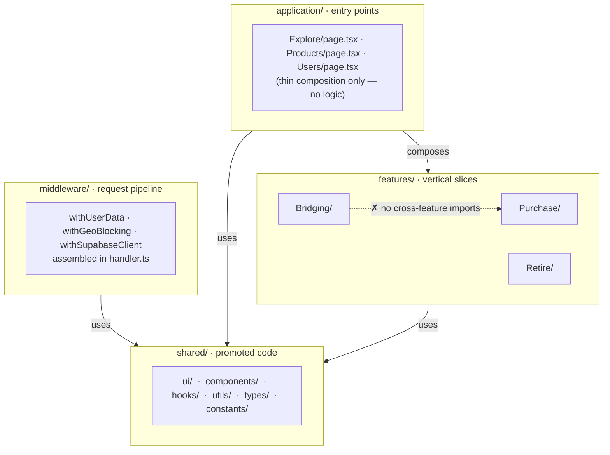

# Feature-Based Frontend Architecture

A framework-agnostic set of principles for organising frontend applications around user-facing capabilities rather than technical role.

---

## Core Idea

Code is grouped by **what the user can do**, not by what type of file it is. A "feature" is a self-contained vertical slice of the application — everything needed to implement one piece of user-facing behaviour lives together.

---

## Architecture Overview



### Inside a feature

```
features/Bridging/
├── Bridging.constants.ts     ← enums, magic values
├── Bridging.hooks.ts         ← data-fetching, stateful logic
├── Bridging.state.ts         ← client state atoms/stores
├── Bridging.types.ts         ← domain types & interfaces
├── Bridging.utils.ts         ← pure transformation helpers
├── api/
│   └── icr/
│       ├── authenticate.ts         ← external API call
│       └── authenticate.types.ts   ← types for that API
└── components/
    └── TransferAssetsModal/
        ├── TransferAssetsModal.tsx        ← component
        ├── TransferAssetsModal.state.ts   ← local state
        ├── TransferAssetsModal.styles.ts  ← styles
        ├── TransferAssetsModal.types.ts   ← component-scoped types
        └── TransferAssetsModal.actions.ts ← async side-effects
```

---

## Top-Level Structure

```
src/
  application/      # Entry points (pages, routes, views)
  features/         # Self-contained feature slices
  shared/           # Cross-feature building blocks
  middleware/       # Request/response pipeline (auth, guards, enrichment)
```

Each layer has a single, well-defined responsibility. Nothing outside a layer should need to understand its internals.

---

## Layer Responsibilities

### `application/`

Thin entry points only. Pages and routes live here, mirroring the URL structure of the app. Their only job is to compose features and shared components into a layout. They contain no business logic.

```
application/
  Explore/
    page.tsx          # Composes feature components
    styles.ts         # Page-level layout styles only
  Products/
    [product_id]/
      page.tsx
      Retire/
        index.tsx     # Nested route treated as its own entry point
```

**Rule:** If you find logic in a page file, it belongs in a feature.

---

### `features/`

Each directory is one user-facing capability. A feature owns everything needed to implement that capability: state, data fetching, types, utilities, constants, and the components that compose them.

```
features/
  Bridging/
    Bridging.constants.ts
    Bridging.hooks.ts
    Bridging.state.ts
    Bridging.styles.ts
    Bridging.types.ts
    Bridging.utils.ts
    api/
      icr/
        authenticate.ts
        authenticate.types.ts
    components/
      TransferAssetsModal/
        TransferAssetsModal.tsx
        TransferAssetsModal.state.ts
        TransferAssetsModal.styles.ts
        TransferAssetsModal.types.ts
```

#### Feature file naming convention

Files at the feature root use the feature name as a prefix:

| Suffix | Contents |
|--------|----------|
| `.constants.ts` | Enums, magic values, lookup tables |
| `.hooks.ts` | Data-fetching and stateful logic hooks |
| `.state.ts` | Client-side state atoms/stores |
| `.styles.ts` | Shared styles for the feature |
| `.types.ts` | Domain types and interfaces |
| `.utils.ts` | Pure transformation and helper functions |

The same suffix convention cascades down to components within the feature:
`TransferAssetsModal.state.ts`, `ListingForm.utils.ts`, etc.

#### Component-level files

Components within a feature follow the same colocation principle — each component gets its own directory:

```
components/
  TransferAssetsModal/
    TransferAssetsModal.tsx        # Component
    TransferAssetsModal.state.ts   # State local to this component
    TransferAssetsModal.styles.ts  # Styles
    TransferAssetsModal.types.ts   # Types specific to this component
```

An `.actions.ts` file may appear at the component level for async side-effects (API calls, server actions) that belong to that component and nothing else.

#### `api/` subdirectory

External API integrations that only one feature uses live inside that feature under `api/`. They are not promoted to shared until a second feature needs them.

---

### `shared/`

Code that two or more features actually use. It is further subdivided by type:

```
shared/
  components/     # Composed, domain-aware components (Layout, HeroCarousel, PageHead)
  ui/             # Primitive, headless building blocks (Button, Card, Alert)
  hooks/          # Reusable stateful logic
  providers/      # Context/provider wrappers
  constants/      # App-wide configuration and lookup values
  types/          # Shared domain types and type guards
  utils/          # Pure utility functions (string, array, date, fetch, etc.)
  styles/         # Global animation, theme tokens
```

#### `ui/` vs `components/`

`ui/` holds primitives — unstyled or minimally styled, domain-agnostic building blocks (Button, Card, Alert). `components/` holds composed, domain-aware pieces that assemble primitives and know about the application's domain (Layout, UserProfile, CategoryShowcase).

**Rule:** If a component imports a domain type, it belongs in `components/`, not `ui/`.

---

### `middleware/`

Request-lifecycle concerns isolated from features: authentication guards, geo-blocking, session enrichment. Each concern is a discrete composable function, assembled in a single `handler.ts` or `index.ts`.

```
middleware/
  handler.ts           # Composed entry point
  withGeoBlocking.ts   # Single-concern middleware
  withSupabaseClient.ts
  withUserData.ts
  middleware.types.ts
  middleware.utils.ts
```

---

## Key Principles

### 1. Colocation over categorisation

Files that change together live together. A feature's component, its state, its styles, and its types are siblings — not scattered across top-level `hooks/`, `store/`, `types/` directories.

### 2. Consistent file suffix taxonomy

The suffix (`*.hooks.ts`, `*.state.ts`, `*.utils.ts`, etc.) communicates the role of a file at a glance. This taxonomy applies at every level — feature root and individual component. It removes the need to read file contents to understand where to look.

### 3. Strict ownership — features don't share with each other

Features import from `shared/`. They do not import from each other. If two features need the same logic, that logic is extracted to `shared/` first. This prevents hidden coupling and makes features independently movable.

### 4. Pages are dumb

Application entry points (`application/`) are thin composition layers. They import from features and shared; they contain no logic of their own. Business rules, data fetching, and state all live in features.

### 5. Locality of state

State is declared at the lowest level that needs it. Component-local state stays in `ComponentName.state.ts` inside that component's directory. Feature-wide state lives in `Feature.state.ts` at the feature root. Only truly global state reaches `shared/providers/`.

### 6. Promote, don't pre-share

Start everything in the feature that needs it. Move to `shared/` only when a second consumer appears. This prevents a bloated shared layer filled with code that serves only one feature.

### 7. Separate data contracts from logic

`.types.ts` files are pure declarations — no runtime code. `.utils.ts` files are pure functions with no side effects. `.hooks.ts` files are the layer that combines them with stateful framework primitives. Keeping these separated makes each independently testable.

### 8. Middleware is its own boundary

Authentication, routing guards, session enrichment, and geo-restrictions live in `middleware/`, not inside features or pages. Each concern is a single-responsibility function composed in one place. Features receive the enriched context as a given; they do not implement it.

---

## What This Is Not

- **Not file-type-based structure** (`components/`, `hooks/`, `store/` at the root). That approach separates things that change together and obscures what a feature is.
- **Not a strict module system**. There are no enforced `index.ts` barrel exports or hard import boundaries — the discipline is applied through naming conventions and team agreement.
- **Not micro-frontends**. Features are compiled together; this is an organisation pattern, not a deployment boundary.
